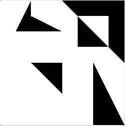
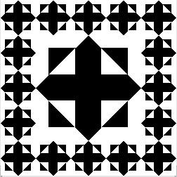
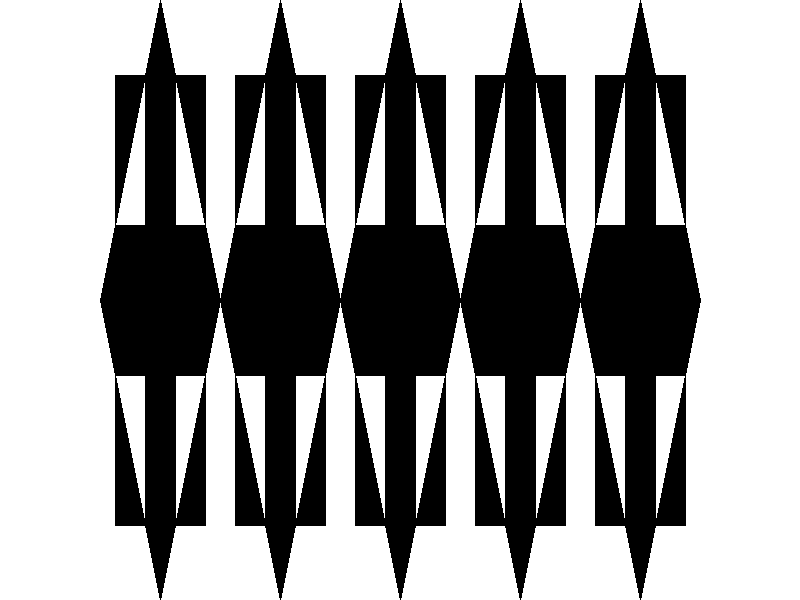
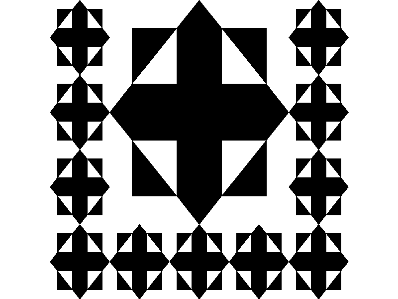
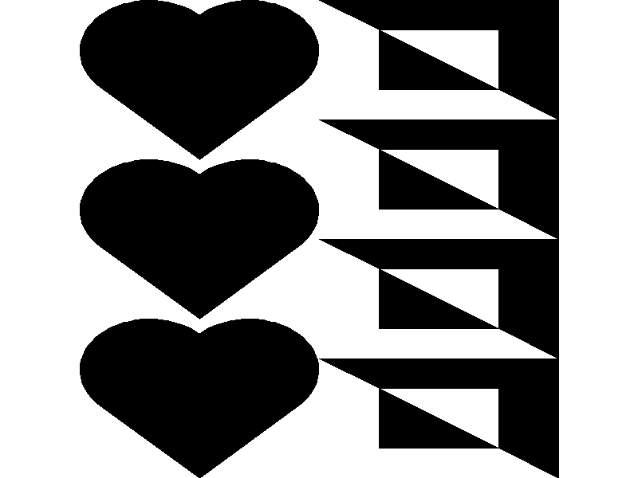

# Mission Brief 2: Runic Runes (Egyptian)

In this mission, you will break a big problem down into parts from the ['top' downwards](https://en.wikipedia.org/wiki/Top-down_and_bottom-up_design), in order to construct a solution bottom-up.

Before you break a problem down, you will need (1) some idea on which "lines" you can break a problem down along and (2) what the atomic building blocks are. Take this image from an earlier mission for example: 



We first need to know that  the functions `stack` and `beside` are available to us before we know that  two "legal moves" are to break the picture into (1) top and bottom halves, and (2) left and right halves. After we have written the function `mosaic`, we can add `mosaic` to our collection of "legal moves", that is, we can break runes into quarters directly.

After this one step of decomposition, we can ask ourselves whether the decomposed parts (in this case, the halves) are indivisible units (in this case, building blocks like `rcross_bb`, `nova_bb` and `sail_bb`). If the  parts are composite (i.e. not indivisible), we again consider how we can break them down using "legal moves". 

## Before you start the mission

So, before you start the mission, please familiarise yourselves with the tools in your toolbox. Here is a list of functions from the "Rune Reading" mission, 

`quarter_turn_right`
`eighth_turn_left`
`flip_horiz`
`flip_vert`
`turn_upside_down`
`quarter_turn_left`
`make_cross`
`repeat_pattern`
`stack`
`stack_frac`
`stackn`
`beside`

After the "Rune Reading" mission, you would have added `simple_fractal` and `mosaic` to your toolbox. You are free to add more of your own functions, even if the missions do not require you to.

Also, you might want to identify all the rune building blocks that you can use to test your functions with. For your convenience, they are:

`black_bb`
`blank_bb`
`circle_bb`
`ribbon_bb`
`heart_bb`
`pentagram_bb`
`rcross_bb`
`corner_bb`
`sail_bb`
`nova_bb`

## Where do I start?

What "legal moves" can you use to break the picture up? :



Say we want to use `stack_frac` to attach the top row to the rest of the picture, then we would need to create the two parts that we want to combine together:





Now we have two easier problems to solve.

## Means of Abstraction

You can give names to pictures that you compose. For example, this code snippet

```python
hearts = stackn(3,heart_bb)
rcrosses = stackn(4, rcross_bb)
hearts_and_rcrosses = beside(hearts, rcrosses)
```

produces



Use meaningful names to make your code more understandable.

## Putting runes side-by-side

Observe that we have three stacking functions (`stack`, `stack_frac` &`stackn`), but only one function (`beside`) to put runes beside each other.

How then is it possible to create the "Top Row" mentioned earlier?

Just like `mosaic`, you can add the 'beside' equivalent of  `stack_frac` and `stackn` to your collection of functions. We implement the two functions by imitating how `beside` was defined. From the lecture slides:

```python
def beside(rune1, rune2):
    return quarter_turn_right(
        stack(quarter_turn_left(rune2), 
              quarter_turn_left(rune1)))
```

Observe that `beside` is defined in terms of `stack` using a rotate-transform-unrotate pattern. Imitate this.

## Your turn

Using the basic functions listed here, try to compose the Egyptian rune by building it up from smaller parts.

