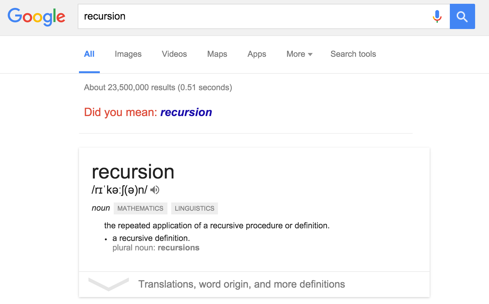
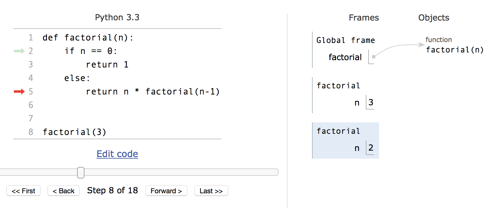

# Recursion

> People often joke that in order to understand recursion, you must first understand recursion.
> - John D. Cook

## Checkpoint Question



*"Did you mean: recusion"* is an [easter egg](https://en.wikipedia.org/wiki/Easter_egg_%28media%29). You should get the inside joke if you have understood recursion.

## Cheat Sheet

Here is a summary of recursion. For a cuter explanation, please consult
[algosaur.us](http://algosaur.us/recursion/).


### Classic 101 Examples

Linear Recursion

```python
def factorial(n):
    if n == 0:
        return 1
    else:
        return n * factorial(n-1)
```

Tree Recursion

```python
def fibonacci(n):
    if n == 0 or n == 1:
        return 1
    else:
        return fibonacci(n-1) + fibonacci(n-2)
```


### Definition

Something is recursive if it is [defined in terms of itself](https://en.wikipedia.org/wiki/Self-similarity). Ingredients for cooking up a recursive function:

- **Base Case(s)** a.k.a. terminating scenario
- **Recursive Call(s)** - the call by the function to itself

## Understanding Recursion

*"Sorry 'cher, I still don't get it..."*

The starting quote has some truth in it. This definition is a good summary of what recursion is, *for someone who already knows recursion*, but it can be unhelpful to new learners. Let's flesh it out a bit.

Here is one way to define factorial:

```
n! = n * (n-1) * (n-2) * ... * 1
```

Here is another way:

```
n!  = n * (n-1)!
```

What is the difference? First, notice that the LHS of the `=` is what we want to define and the RHS is our definition. The difference is that the second definition involves a factorial, i.e. it contains a `!`, but the first one does not. This is what we mean  when we say that factorial is *defined in terms of itself*.

For the uninitiated, `n!  = n * (n-1)!` is baffling. The conversation in his/her head might go:

- "So `n!  = n * (n-1)!`. Hmm... okay. But what is `(n-1)!`? How would I know how to compute that if I don't know what `!` does?!"
- "Right, so if we substitute `n` with `n-1` in the formula, we get `(n-1)! = (n-1) * ((n-1) - 1)!` or more simply `(n-1)! = (n-1) * (n-2)!`. Okay, cool. We are getting somewhere, aren't we? So if we put it together, we get  `n! = n * (n-1) * (n-2)!`."
- "No, wait. Don't we have the same problem again? This will go on and on, right?"

And the student would be right. The process does not terminate because there is no termination condition. The proper definition should be:


```
n!  =  n * (n-1)!   if n > 0
       1            if n = 0
```

From this, we see the importance of carefully choosing *base cases* so that whenever a valid input is given,
a recursive calculation will always terminate. Sometimes, we need more than one base case,. For example, `fibonacci` has two base cases: the case when `n` is `0` and the case when `n` is `1`.

### Why is recursion so hard??

Recursion is hard. It's normal to struggle at the start, so don't feel lousy if you do.

While many learning resources tell you what  recursion *is* ("recursion = base case + recursive step, blah blah blah"), few try to address *why* it is so counter-intuitive. If we could identify and explain the most difficult parts of the concept of recursion with pin-point accuracy, can we help learners reach their "Aha!" moment more quickly?

#### Recursive Call Frames

The Python interpreter runs one line of code at a time. However, for recursive functions, it can seem that more than one line of code are running simultaneously.

Let's number the definition for `factorial`:

```
1: def factorial(n):
2:    if n == 0:
3:        return 1
4:    else:
5:         return n * factorial(n-1)
```

Suppose that we call `factorial(3)`. The code will run until Line 5 where it encounters the recursive call. Since the function needs the value of `factorial(2)` before it can do the multiplication, the `*` operation is *deferred*. Next, the call to `factorial(2)` is made and we enter the `if` structure at Line 2.

Let us pause. Right now, it seems that the interpreter is 'stuck' at Line 5, yet at the same time executing Line 2. How can that be?



To resolve this, we can introduce the idea of an execution *frame*. It becomes clear that Line 5 is being run for the  `factorial(3)` frame and Line 2 is being run for the `factorial(2)` frame. Right now, the frame for `factorial(2)` is the current (active) frame while the rest are not currently being run.

Another way to work around the confusion is to imagine that a new copy of the code is created every time a recursive call is made. When there are multiple frames stuck on the same line, we can easily visualise which they are.

#### Wishful Thinking

Writing recursive functions require you to take a step of faith.

One day, Leonardo was doing his programming assignment. His teacher had tasked the class to write `fibonacci`. He thought he had his answer nailed down and proceeded to type his solution out:

```python
def fibonacci(n):
    if n == 0 or n == 1:
        return 1
    else:
        return fibona|
```

He stopped in his tracks, cursor blinking away at the same spot. A sudden pang of doubt washed over him.

"Wait a minute. Isn't the function that I'm about to use, `fibonacci`, one that I've not yet completed writing? How do I know that this function that I'm about to use will do what I expect it to do? If I can't be sure that this function will be correct, how can I be sure that the function I'm currently writing will do the right thing?"

Thus is a subtle paradox when writing recursive functions. Many of Leonardo's classmates experience an eerie uncertainty, but can't quite put a finger to their discomfort.

It is Monday and the assignments are due. Leonardo approached his teacher about his doubt, cursor still blinking on his screen. His teacher explained,
"Before the code can be completed on your machine, it must be complete in your mind. Have faith that you will be able to correctly implement the function that you are about to use. Only if you take the leap and use that function, will that function ever be correct. I believe in you."

Leonardo took his teacher's instruction to heart and with wanton *wishful thinking*, simply (and almost carelessly) assumed that any function that he wanted to use existed. He used them first, worrying about their existence later.

Armed with this insight, he went on to have an illustrious career as a computer programmer. His crowing achievement was to discover the [Fibonacci](https://en.wikipedia.org/wiki/Fibonacci) numbers. After many years, he decided that he wanted to raise the next generation and became a teacher.

He was exactly his teacher's age when he started his new career. The first assignment that he set for his students was to write a function to generate his namesake numbers. There happened to be in his class a bright boy named Leonardo.

## Recursion in Python

### Factorial Function with Tracing

The function below is simply factorial, but with print statements
to illustrate what's happening.

```python
def fact(n, indent):
    if n == 0:
        print(indent + "BASE CASE: 1\n")
        return 1
    else:
        print(indent + str(n) + "! = " + str(n) + " * " + str(n-1) + "!")
        prev_result = fact(n-1, indent + "  ")
        result =  n * prev_result
        print(indent + str(result) + " = " + str(n) + " * " + str(prev_result))
        return result

print("\n" + str(fact(6, "")))
```

Run it and trace through the print statements to see how the function
approaches the base case, then propagates the result up to obtain the
final answer.
