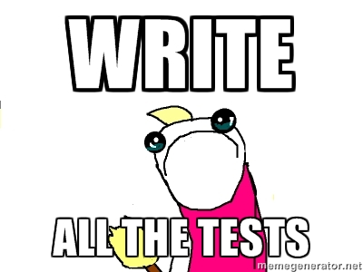
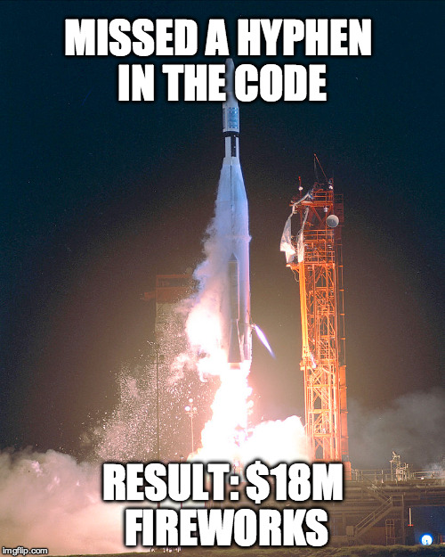
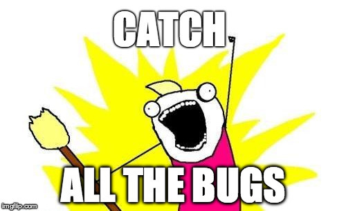

# Software Testing

## Why should I care?



> "My code is working already. Why do I need to test?"

> "Aiyo, so troublesome, why cannot test by hand."

Unfortunately, for new learners, writing tests can seem like an unnecessary, meaningless chore. This is because most of the programs that we write are really simple and our goal oftentimes is just to pass the grader. No one is ever going to use the code that we write in class for a real product. Not even us. Who cares if our programs are bulletproof?

Alas, it is all an academic exercise, just like the programs that we write. Still, let's endeavour to understand why and how we write tests.

### Uncaught bugs can be costly and deadly



[Car crashes](http://blog.celerity.com/the-true-cost-of-a-software-bug),
[radiation overdose](https://en.wikipedia.org/wiki/Therac-25),
revenue loss, spacecraft malfunctions, stolen data.
It's not hard to see why software bugs are not harmless and benign.
They can be as deadly as a flu bug in certain contexts.

## Tests provide assurance

The complexity of a system grows exponentially with the number of components.
A space rocket can have thousands of parts and it takes a single malfunctioning
part to cause the whole craft to malfunction.

How can we ensure that we do not suffer disaster or loss? Is there a foolproof way
to catch all the bugs?

Let's consider the function `bowling_score` that you are supposed to write for your mission.
Is there a way to be sure that your function is error-free?

One way is to test all possible valid inputs.
We do not care about what the function returns if invalid inputs are given
since the function's behaviour for them is undefined.
We can do this testing systematically:

```python
bowling_score("00000000000000000000") # => 0
bowling_score("10000000000000000000") # => 1
bowling_score("20000000000000000000") # => 2
...
bowling_score("XXXXXXXXXXXX") # => 300
```

There are at least $$10^{12}$$ of them to test, but if your function passes all the
tests, is it possible for your function to produce the wrong result,
assuming a input given is valid? No. Your function would have failed the test
case for that input otherwise.



Thus, with tests, it is possible for us to have assurance that programs are error-free.
However, it is not feasible to write trillions of tests.
Instead, by choosing our tests wisely, we can have high levels of assurance
with a smaller set of tests. We explore how to do this in the next section.

## Testing Techniques

To complete the mission, your task is essentially to figure out which of these trillions
of possible inputs to pick as test cases. This is an art and not a precise science.

To aid us, we can use these two concepts:

- **Effectiveness.** Your test set is more effective than mine if it catches more bugs.
- **Efficiency.** Your test set is more efficient than mine if it can achieve the same efficiency with a smaller set of test.

One technique is to divide the test cases into groups (or *partitions*) and pick a few representative
test cases from each group (where each member is considered to be *equivalent* in some way).
This is known as **Equivalence Partitioning**.

Let's try it on a simpler example:

> Write a function `can_buy_wine(age, time)` that returns `True` if a customer in Singapore
is allowed to buy a bottle of wine and `False` otherwise.
The function takes as integer input the buyer's age and the current time.
Customers are only allowed to buy wine if the time is between 0701 and 2229
and if they are 18 years old and above.

What are the possible combinations of inputs for this function?

(`age`-`time` graph)

How can we group the possible inputs?

Which representatives should we pick?
By doing **Boundary Value Analysis**, we can pick test cases that guard against
the ubiquitous **off-by-one error**.

Another technique is to examine **Code Coverage**:
how many times is each line of code run when you execute the tests?

You will need to ensure that every line of code is run at least once
if you want to ensure that each part of your program is working correctly.
One way to visualize this is to draw the program's flowchart.
The equivalent of ensuring each line of code once is run once is to ensure that each "path"
of the flowchart is traversed at least once by your test set.
